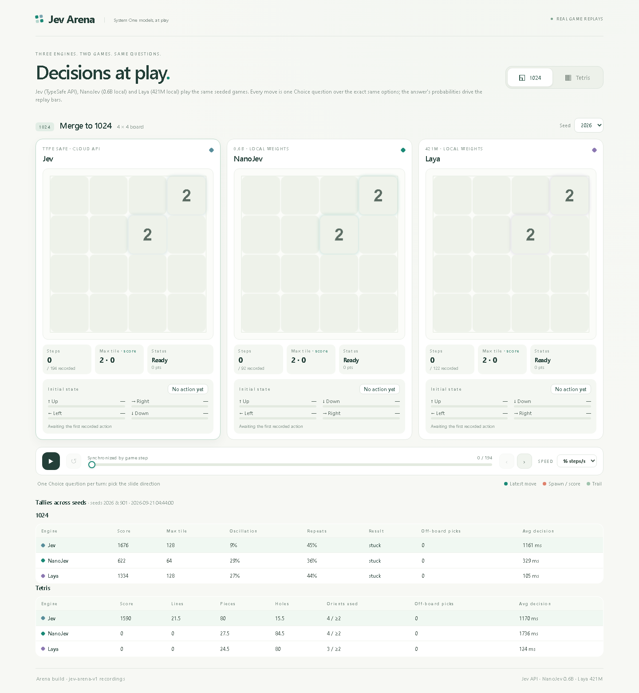

# Jev Arena — System One 模型实战对比场

让 **Jev**（TypeSafe 云端 API）、**NanoJev**（0.6B 本地权重）、**Laya**（421M 本地权重）在
**俄罗斯方块** 和 **1024** 两款游戏上用完全相同的问题序列对局，录制每一步的选择与概率分布，
在参考 [nanojev 展示站](https://nanojev.tianyuchen99.chatgpt.site/) 风格的三面板回放页中同步播放。



## 快速开始

```bash
# 1. 录制对局（需要 .env 里的 TYPESAFE_API_KEY；nanojev/laya 走本地 venv）
python runner/run_matches.py

# 2. 打开回放站
cd web && python -m http.server 8775
# 浏览器打开 http://127.0.0.1:8775  （#tetris 直达俄罗斯方块）

# 3. 跑游戏引擎单测 / 站点验证
python test_games.py
python verify_site.py   # 需要 playwright + 本地 8775 服务
```

## 目录结构

```
jev-arena/
├── games/
│   ├── tetris.py        # 俄罗斯方块：每步一个 Choice（选放置列，固定朝向）
│   └── game1024.py      # 1024：每步一个 Choice（选滑动方向，描述含真实合并后果）
├── runner/
│   ├── engines.py       # 三引擎统一适配 + 契约规范化（argmax/sum=1 强制）
│   ├── nanojev_worker.py  # 行协议子进程（独立 venv: nanojev/.venv, bf16）
│   ├── laya_worker.py     # 行协议子进程（独立 venv: jevshoot/.venv-laya）
│   ├── run_matches.py   # 对局录制主程序（断点续跑、增量落盘）
│   └── smoke.py         # 三引擎冒烟
├── web/                 # 纯静态回放站（无框架无外部脚本）
│   ├── index.html / arena.js / arena.css
│   ├── arena_results.json   # 完整录像（含 raw_answers/usage）
│   └── arena_slim.json      # 瘦身版（网格逗号编码，342KB）
├── test_games.py        # 游戏引擎单元测试（7 项）
├── verify_site.py       # Playwright 站点验证（8 项断言 + 截图）
├── ACCEPTANCE.md        # 量化验收报告 + 弯路复盘
└── .env                 # TYPESAFE_API_KEY / TYPESAFE_MODEL（不入库）
```

## 对局协议（公平性保证）

- 同 (game, seed) 下三引擎看到**逐字节相同**的 state 文本与选项描述
- 每步一个问题：`type=choice`，选项 id 即动作（Tetris 列号 / 1024 四方向）
- 答案规范化到 TypeSafe 契约：probabilities 键完备、归一、choice=argmax
- 选中非法动作时记 `violation` 并按合法子集 argmax 兜底（全程 0 次发生）

## 结论速览（详见 ACCEPTANCE.md）

| | Tetris | 1024 | 每步延迟 |
|---|---|---|---|
| **Jev** | 唯一消行得分（均值 20 分） | 4 分 | ~1.2s（API） |
| **NanoJev** | 0 分但决策正常 | 4 分 | ~0.24s |
| **Laya** | 0 分 | 0 分（来回平移） | ~0.1s |

## 致谢与参考

- 风格与交互范式参考 [NanoJev side-by-side 展示站](https://nanojev.tianyuchen99.chatgpt.site/)（Tianyu Chen, NanoJev 作者，源码在本地 `F:\Space\PRO\test\nanojev\NanoJev\web\`）
- [TypeSafe Jev 文档](https://docs.typesafe.ai/introduction) · [NanoJev](https://github.com/TianyuCodings/NanoJev) · [laya](https://huggingface.co/convaiinnovations/laya)
